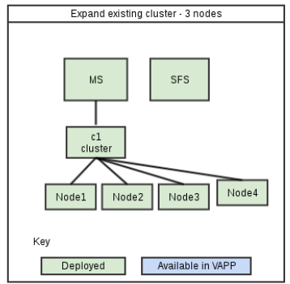

.. _expan-label:

Expansion Testing in the cloud 
===============================

A common LITP use case is to expand an existing deployment to increase the number of nodes. This can be done either through adding nodes to an existing cluster or by adding a whole new cluster to a deployment.

This section details how specialised KGBs can be used alongside utilities provided in this framework to perform expansion testing.

What is an expansion KGB ?
---------------------------

An expansion KGB is a KGB which has only 1 node deployment. The VAPP has 4 managed nodes in total which means KGB tests can expand the deployment by three additional nodes as part of expansion testing. See the diagram below.

Only specific repos have an expansion KGB, if you have a use case to add expansion test cases in your repo please contact the CI Team.

Supported expansion cases
------------------------------

Expansion of the cluster is achieved by running speclised deployment scripts which are maintained by the CI team. This section will detail which scripts to call in whic situation. In all cases the 
execute_ai_scripts method in generic test can be used.

a. Expand the existing cluster by 1 node
^^^^^^^^^^^^^^^^^^^^^^^^^^^^^^^^^^^^^^^^^

If you wish to expand the existing cluster by one node to reach a state as shown below:

You will need to use the **expand_cloud_c1_mn2.sh** script within your test as shown below:

.. code-block:: python

    @attr('all', 'story100', 'story100_tc01', 'expansion')
    def test_01_p_test_expansion(self):
        """
        Description:
        Tests expansion of a deployment.
        """
        #1. We create a list of the nodes we will be adding. Note if using a
        #script name which contains 'mn2' you should use node2. If using a
        #script with contains 'mn3' you should add 'node3'
        nodes_to_expand = list()
        nodes_to_expand.append("node2")

        #2. Execute the expand script for expanding cluster 1 with node2.
        # Note this does not create or run the plan.
        self.execute_expand_script(self.test_ms,
                                'expand_cloud_c1_mn2.sh')

        #3. Make edits/additions to the model for the particular test case
        #.
        #.

        #4. Run plan and wait for it to complete the expansion.
        timeout_mins = 60
	self.run_and_check_plan(self.test_ms,
                                test_constants.PLAN_COMPLETE,
                                timeout_mins,
				add_to_cleanup=False)

        #5. If the expansion has suceeded we restore_snapshot to bring us
        # back to a one node state again. Note we set the poweroff_nodes value
        # as expanded nodes should be powered off before restoring back.
        self.execute_and_wait_restore_snapshot(self.test_ms,
                                               poweroff_nodes=nodes_to_expand)

        #6. Create a new snapshot for the next test to have a restore_point
        self.execute_and_wait_createsnapshot(self.test_ms)

b. Expand the existing cluster by 2 nodes
^^^^^^^^^^^^^^^^^^^^^^^^^^^^^^^^^^^^^^^^^^

If you wish to expand the existing cluster by two nodes to reach a state as shown below:

.. image:: 4node_exp-2.png

You will need to use the **expand_cloud_c1_mn2.sh** and **expand_cloud_c1_mn3.sh** script within your test as shown below:

.. code-block:: python

    @attr('all', 'story100', 'story100_tc01', 'expansion')
    def test_01_p_test_expansion(self):
        """
        Description:
        Tests expansion of a deployment
        """
	#1. We create a list of the nodes we will be adding. Note if using a
        #script name which contains 'mn2' you should use node2. If using a
        #script with contains 'mn3' you should add 'node3'
        nodes_to_expand = list()
        nodes_to_expand.append("node2")

        #2. Execute the expand script for expanding cluster 1 with node2/node3.
        # Note this does not create or run the plan.
        self.execute_expand_script(self.test_ms,
                                'expand_cloud_c1_mn2.sh')
        self.execute_expand_script(self.test_ms,
                                'expand_cloud_c1_mn3.sh')

        #3. Make edits/additions to the model for the particular test case
        #.
        #.

        #4. Run plan and wait for it to complete the expansion.
        timeout_mins = 60
	self.run_and_check_plan(self.test_ms,
                                test_constants.PLAN_COMPLETE,
                                timeout_mins,
				add_to_cleanup=False)

        #5. If the expansion has suceeded we restore_snapshot to bring us
        # back to a one node state again. Note we set the poweroff_nodes value
        # as expanded nodes should be powered off before restoring back.
        self.execute_and_wait_restore_snapshot(self.test_ms,
                                               poweroff_nodes=nodes_to_expand)

        #6. Create a new snapshot for the next test to have a restore_point
        self.execute_and_wait_createsnapshot(self.test_ms)

c. Expand the existing cluster by 3 nodes
^^^^^^^^^^^^^^^^^^^^^^^^^^^^^^^^^^^^^^^^^^

If you wish to expand the existing cluster by three nodes to reach a state as shown below:

You will need to use the **expand_cloud_c1_mn2.sh**, **expand_cloud_c1_mn3.sh** and **expand_cloud_c1_mn4.sh** scripts within your test as shown below:

.. code-block:: python

    @attr('all', 'story100', 'story100_tc01', 'expansion')
    def test_01_p_test_expansion(self):
        """
        Description:
        Tests creation 3 new nodes in the existing cluster.

        Actions:
          - Run a deployment script which:
               - expands an existing cluster by three nodes
          - Restore to previous snapshot
          - Create a new snapshot
        """
        #1. We create a list of the nodes we will be adding. Note if using a
        #script name which contains 'mn2' you should use node2. If using a
        #script with contains 'mn3' you should add 'node3'
        nodes_to_expand = list()
        nodes_to_expand.append("node2")
        nodes_to_expand.append("node3")
        nodes_to_expand.append("node4")

        #3. Execute the expand script for expanding cluster 1 with node2
        # node 3 and node4
        # Note this does not create or run the plan.
        self.execute_expand_script(self.test_ms,
                    'expand_cloud_c1_mn2.sh',
                    workspace='/home/lciadm100/jenkins/workspace/VExpand_CDB/',
                    cluster_filename='192.168.0.42_4node.sh')
        self.execute_expand_script(self.test_ms,
                    'expand_cloud_c1_mn3.sh',
                    workspace='/home/lciadm100/jenkins/workspace/VExpand_CDB/',
                    cluster_filename='192.168.0.42_4node.sh')
        self.execute_expand_script(self.test_ms,
                    'expand_cloud_c1_mn4.sh',
                    workspace='/home/lciadm100/jenkins/workspace/VExpand_CDB/',
                    cluster_filename='192.168.0.42_4node.sh')

        #4. Make edits/additions to the model for the particular test case
        #.
        #.

        #5. Run plan and wait for it to complete the expansion.
        timeout_mins = 60
        self.run_and_check_plan(self.test_ms,
                                test_constants.PLAN_COMPLETE,
                                timeout_mins, add_to_cleanup=False)

        #6. If the expansion has suceeded we restore_snapshot to bring us
        # back to a one node state again. Note we set the poweroff_nodes value
        # as expanded nodes should be powered off before restoring back.
        self.execute_and_wait_restore_snapshot(self.test_ms,
                                               poweroff_nodes=nodes_to_expand)
        self.run_command(self.test_ms, '/usr/bin/mco ping')
        self.execute_cli_removesnapshot_cmd(self.test_ms)

        self.assertTrue(self.wait_for_plan_state(self.test_ms,
                                                 test_constants.PLAN_COMPLETE)
                                                 "Plan is not in expected state")

        self.execute_and_wait_createsnapshot(self.test_ms,
                                             add_to_cleanup=False)

        self.execute_and_wait_restore_snapshot(self.test_ms)

d. Create a new cluster with 1 node
^^^^^^^^^^^^^^^^^^^^^^^^^^^^^^^^^^^^^^

If you wish to create a new cluster with one node as shown below:

You will need to create the new cluster yourself with required options and then use the **expand_cloud_c2_mn2.sh** script. You must have a cluster with a name of **c2**

See the below example.

.. code-block:: python

    @attr('all', 'story100', 'story100_tc01', 'expansion')
    def test_01_p_test_expansion(self):
        """
        Description:
        Tests expansion of a deployment
        """
	#1. We create a list of the nodes we will be adding. Note if using a
        #script name which contains 'mn2' you should use node2. If using a
        #script with contains 'mn3' you should add 'node3' and 'node4' for 'mn4'
        nodes_to_expand = list()
        nodes_to_expand.append("node2")
        nodes_to_expand.append("node3")

        #2. Create a new cluster 2
        cluster_collect = self.find(self.test_ms, '/deployments',
                                'cluster', False)[0]
        props = 'cluster_type=sfha low_prio_net=mgmt llt_nets=hb1,hb2 ' +\
                'cluster_id=1043'
        self.execute_cli_create_cmd(self.test_ms,
                                cluster_collect + "/c2",
                                'vcs-cluster',
                                 props)

        #3. Execute the expand script for creating cluster 2 with node2
        # Note this does not create or run the plan.
        self.execute_expand_script(self.test_ms,
                                'expand_cloud_c2_mn2.sh')

        #4. Make edits/additions to the model for the particular test case
        #.
        #.

        #5. Run plan and wait for it to complete the expansion.
        timeout_mins = 60
	self.run_and_check_plan(self.test_ms,
                                test_constants.PLAN_COMPLETE,
                                timeout_mins,
				add_to_cleanup=False)

        #6. If the expansion has suceeded we restore_snapshot to bring us
        # back to a one node state again. Note we set the poweroff_nodes value
        # as expanded nodes should be powered off before restoring back.
        self.execute_and_wait_restore_snapshot(self.test_ms,
                                               poweroff_nodes=nodes_to_expand)

        #7. Create a new snapshot for the next test to have a restore_point
        self.execute_and_wait_createsnapshot(self.test_ms, add_to_cleanup=False)
	

e.  Create a new cluster with 2 nodes
^^^^^^^^^^^^^^^^^^^^^^^^^^^^^^^^^^^^^^

If you wish to create a new cluster with two nodes as shown below:

You will need to create the new cluster with required options within the test and then use the **expand_cloud_c2_mn2.sh** and **expand_cloud_c2_mn3.sh** script. You must have a cluster with a name of **c2**

See the below example.

.. code-block:: python

    @attr('all', 'story100', 'story100_tc01', 'expansion')
    def test_01_p_test_expansion(self):
        """
        Description:
        Tests expansion of a deployment.
        """
	#1. We create a list of the nodes we will be adding. Note if using a
        #script name which contains 'mn2' you should use node2. If using a
        #script with contains 'mn3' you should add 'node3' and 'node4' for 'mn4'
        nodes_to_expand = list()
        nodes_to_expand.append("node2")

        #2. Create a new cluster 2
        cluster_collect = self.find(self.test_ms, '/deployments',
                                'cluster', False)[0]
        props = 'cluster_type=sfha low_prio_net=mgmt llt_nets=hb1,hb2 ' +\
                'cluster_id=1043'
        self.execute_cli_create_cmd(self.test_ms,
                                cluster_collect + "/c2",
                                'vcs-cluster',
                                 props)

        #3. Execute the expand script for expanding cluster 2 with node2/node3.
        # Note this does not create or run the plan.
        self.execute_expand_script(self.test_ms,
                                'expand_cloud_c2_mn2.sh')
        self.execute_expand_script(self.test_ms,
                                'expand_cloud_c2_mn2.sh')

        #4. Make edits/additions to the model for the particular test case
        #.
        #.

        #5. Run plan and wait for it to complete the expansion.
        timeout_mins = 60
	self.run_and_check_plan(self.test_ms,
                                test_constants.PLAN_COMPLETE,
                                timeout_mins,
				add_to_cleanup=False)

        #6. If the expansion has suceeded we restore_snapshot to bring us
        # back to a one node state again. Note we set the poweroff_nodes value
        # as expanded nodes should be powered off before restoring back.
        self.execute_and_wait_restore_snapshot(self.test_ms,
                                               poweroff_nodes=nodes_to_expand)

        #7. Create a new snapshot for the next test to have a restore_point
        self.execute_and_wait_createsnapshot(self.test_ms, add_to_cleanup=False)

f.  Create a new cluster with 3 nodes
^^^^^^^^^^^^^^^^^^^^^^^^^^^^^^^^^^^^^^

If you wish to create a new cluster with three nodes as shown below:

You will need to create the new cluster yourself with required options and then use the **expand_cloud_c2_mn2.sh**, **expand_cloud_c2_mn3.sh** and **expand_cloud_c2_mn4.sh scripts**. You must have a cluster with a name of **c2**.

See the below example.

.. code-block:: python

    @attr('all', 'story100', 'story100_tc01', 'expansion')
    def test_01_p_test_expansion(self):
        """
        Description:
        Tests creation of a new clusters each with 3 nodes in the second
        cluster.

        Then performs the following actions:
           - Runs 3 deployment scripts which creates a new clusters of
             3 nodes
          - Create a new snapshot
          - Restore to created snapshot
        """
        #1. We create a list of the nodes we will be adding. Note if using a
        #script name which contains 'mn2' you should use node2. If using a
        #script with contains 'mn3' you should add 'node3'
        nodes_to_expand = list()
        nodes_to_expand.append("node2")
        nodes_to_expand.append("node3")
        nodes_to_expand.append("node4")

        #2. Create a new cluster 2
        cluster_collect = self.find(self.test_ms, '/deployments',
                                'cluster', False)[0]
        props = 'cluster_type=sfha low_prio_net=mgmt llt_nets=hb1,hb2 ' +\
                'cluster_id=1043'
        self.execute_cli_create_cmd(self.test_ms,
                                cluster_collect + "/c2",
                                'vcs-cluster',
                                 props, add_to_cleanup=False)

        #4. Execute the expand script for expanding cluster 2 with node2
        # node3and node4.
        # Note this does not create or run the plan.
        self.execute_expand_script(self.test_ms,
                                   'expand_cloud_c2_mn2.sh',
                                    cluster_filename='192.168.0.42_4node.sh')
        self.execute_expand_script(self.test_ms,
                                   'expand_cloud_c2_mn3.sh',
                                    cluster_filename='192.168.0.42_4node.sh')
        self.execute_expand_script(self.test_ms,
                                   'expand_cloud_c2_mn4.sh',
                                    cluster_filename='192.168.0.42_4node.sh')

        #5. Make edits/additions to the model for the particular test case
        #.
        #.

        #6. Run plan and wait for it to complete the expansion.
        timeout_mins = 60
        self.run_and_check_plan(self.test_ms,
                                test_constants.PLAN_COMPLETE,
                                timeout_mins, add_to_cleanup=False)

        self.run_command(self.test_ms, '/usr/bin/mco ping')
        self.execute_cli_removesnapshot_cmd(self.test_ms)

        self.assertTrue(self.wait_for_plan_state(self.test_ms,
                                                 test_constants.PLAN_COMPLETE)
                                                 "Plan is not in expected state")

        self.execute_and_wait_createsnapshot(self.test_ms,
                                             add_to_cleanup=False)

        self.execute_and_wait_restore_snapshot(self.test_ms)

g. Expand the existing cluster by 1 node and create a new cluster of 1 node
^^^^^^^^^^^^^^^^^^^^^^^^^^^^^^^^^^^^^^^^^^^^^^^^^^^^^^^^^^^^^^^^^^^^^^^^^^^^

If you wish to expand an existing cluster and create a new cluster as shown below:

You will need to create the new cluster with required options in the test and then use the **expand_cloud_c1_mn2.sh** and **expand_cloud_c2_mn3.sh** script. You must have a cluster with a name of **c2**

See the below example.

.. code-block:: python

    @attr('all', 'story100', 'story100_tc01', 'expansion')
    def test_01_p_test_expansion(self):
        """
        Description:
        Tests expansion of a deployment.
        """
	#1. We create a list of the nodes we will be adding. Note if using a
        #script name which contains 'mn2' you should use node2. If using a
        #script with contains 'mn3' you should add 'node3' and 'node4' for 'mn4'
        nodes_to_expand = list()
        nodes_to_expand.append("node2")
        nodes_to_expand.append("node3")

        #2. Create a new cluster 2
        cluster_collect = self.find(self.test_ms, '/deployments',
                                'cluster', False)[0]
        props = 'cluster_type=sfha low_prio_net=mgmt llt_nets=hb1,hb2 ' +\
                'cluster_id=1043'
        self.execute_cli_create_cmd(self.test_ms,
                                cluster_collect + "/c2",
                                'vcs-cluster',
                                 props)

        #3. Execute the expand script for expanding cluster 1 with node2
        # and cluster 2 with node 3.
        # Note this does not create or run the plan.
        self.execute_expand_script(self.test_ms,
                                'expand_cloud_c1_mn2.sh')
        self.execute_expand_script(self.test_ms,
                                'expand_cloud_c2_mn3.sh')

        #4. Make edits/additions to the model for the particular test case
        #.
        #.

        #5. Run plan and wait for it to complete the expansion.
        timeout_mins = 60
	self.run_and_check_plan(self.test_ms,
                                test_constants.PLAN_COMPLETE,
                                timeout_mins,
				add_to_cleanup=False)

        #6. If the expansion has suceeded we restore_snapshot to bring us
        # back to a one node state again. Note we set the poweroff_nodes value
        # as expanded nodes should be powered off before restoring back.
        self.execute_and_wait_restore_snapshot(self.test_ms,
                                               poweroff_nodes=nodes_to_expand)

        #7. Create a new snapshot for the next test to have a restore_point
        self.execute_and_wait_createsnapshot(self.test_ms, add_to_cleanup=False)

h. Expand the existing cluster by 1 node and create a new cluster of 2 nodes
^^^^^^^^^^^^^^^^^^^^^^^^^^^^^^^^^^^^^^^^^^^^^^^^^^^^^^^^^^^^^^^^^^^^^^^^^^^^^

If you wish to expand the existing cluster by one node, and create a new cluster with two nodes to reach a state as shown below:

To expand the first cluster you will need to use the **expand_cloud_c1_mn2.sh script**. You will need to create the second cluster with required options within the test and then use the **expand_cloud_c2_mn3.sh** and **expand_cloud_c2_mn4.sh script**. You must have a cluster with a name of **c2**.

.. code-block:: python

    @attr('all', 'story100', 'story100_tc01', 'expansion')
    def test_01_p_test_expansion(self):
       """
        Description:
        Tests creation of a new clusters with 2 nodes in the second
        cluster and one node in the first

        Then performs the following actions:
           - Runs 3 deployment scripts which creates a new clusters of
             2 nodes and adds 1 node to the first
          - Create a new snapshot
          - Restore to created snapshot
        """
        #1. We create a list of the nodes we will be adding. Note if using a
        #script name which contains 'mn2' you should use node2. If using a
        #script with contains 'mn3' you should add 'node3'
        nodes_to_expand = list()
        nodes_to_expand.append("node2")
        nodes_to_expand.append("node3")
        nodes_to_expand.append("node4")

        #2. Create a new cluster 2
        cluster_collect = self.find(self.test_ms, '/deployments',
                                'cluster', False)[0]
        props = 'cluster_type=sfha low_prio_net=mgmt llt_nets=hb1,hb2 ' +\
                'cluster_id=1043'
        self.execute_cli_create_cmd(self.test_ms,
                                cluster_collect + "/c2",
                                'vcs-cluster',
                                 props, add_to_cleanup=False)

        #4. Execute the expand script for expanding cluster 2 with
        # node3 and node4 and adds node2 to cluster 1
        # Note this does not create or run the plan.
        self.execute_expand_script(self.test_ms,
                                   'expand_cloud_c1_mn2.sh',
                                    cluster_filename='192.168.0.42_4node.sh')
        self.execute_expand_script(self.test_ms,
                                   'expand_cloud_c2_mn3.sh',
                                    cluster_filename='192.168.0.42_4node.sh')
        self.execute_expand_script(self.test_ms,
                                   'expand_cloud_c2_mn4.sh',
                                    cluster_filename='192.168.0.42_4node.sh')

        #5. Make edits/additions to the model for the particular test case
        #.
        #.

        #6. Run plan and wait for it to complete the expansion.
        timeout_mins = 60
        self.run_and_check_plan(self.test_ms,
                                test_constants.PLAN_COMPLETE,
                                timeout_mins, add_to_cleanup=False)

        self.run_command(self.test_ms, '/usr/bin/mco ping')
        self.execute_cli_removesnapshot_cmd(self.test_ms)

        self.assertTrue(self.wait_for_plan_state(self.test_ms,
                                                 test_constants.PLAN_COMPLETE)
                                                 "Plan is not in expected state")

        self.execute_and_wait_createsnapshot(self.test_ms,
                                             add_to_cleanup=False)

        self.execute_and_wait_restore_snapshot(self.test_ms)

i. Expand the existing cluster by 2 nodes and create a new cluster of 1 node
^^^^^^^^^^^^^^^^^^^^^^^^^^^^^^^^^^^^^^^^^^^^^^^^^^^^^^^^^^^^^^^^^^^^^^^^^^^^^

If you wish to expand the existing cluster by two nodes, and create a new cluster with one node to reach a state as shown below:

To expand the first cluster you will need to use the **expand_cloud_c1_mn2.sh** and **expand_cloud_c1_mn3.sh** scripts. You will need to create the second cluster with required options within the test and then use the **expand_cloud_c2_mn4.sh**. You must have a cluster with a name of **c2**.

.. code-block:: python

    @attr('all', 'story100', 'story100_tc01', 'expansion')
    def test_01_p_test_expansion(self):
        """
        Description:
        Tests expansion of a deployment.
        """
        # 1. We create a list of the nodes we will be adding. Note if using a
        # script name which contains 'mn2' you should use node2. If using a
        # script with contains 'mn3' you should add 'node3' and 'node4' for
        # 'mn4'
        nodes_to_expand = list()
        nodes_to_expand.append("node2")
        nodes_to_expand.append("node3")
        nodes_to_expand.append("node4")

        # 2. Execute the expand script for expanding cluster 1 with node2 and
        # node3.
        # Note this does not create or run the plan.
        self.execute_expand_script(self.test_ms,
                                   'expand_cloud_c1_mn2.sh',
                                   cluster_filename='192.168.0.42_4node.sh')
        self.execute_expand_script(self.test_ms,
                                   'expand_cloud_c1_mn3.sh',
                                   cluster_filename='192.168.0.42_4node.sh')

        # 3. Create a new cluster 2
        cluster_collect = self.find(self.test_ms, '/deployments',
                                    'cluster', False)[0]
        props = 'cluster_type=sfha low_prio_net=mgmt llt_nets=hb1,hb2 ' + \
                'cluster_id=1043'
        self.execute_cli_create_cmd(self.test_ms,
                                    cluster_collect + "/c2",
                                    'vcs-cluster',
                                    props)

        # 4. Execute the expand script for expanding cluster 2 with node4.
        # Note this does not create or run the plan.
        self.execute_expand_script(self.test_ms,
                                   'expand_cloud_c2_mn4.sh',
                                   cluster_filename='192.168.0.42_4node.sh')

        # 5. Make edits/additions to the model for the particular test case
        # .
        # .

        # 6. Run plan and wait for it to complete the expansion.
        timeout_mins = 60
        self.run_and_check_plan(self.test_ms,
                                test_constants.PLAN_COMPLETE,
                                timeout_mins,
                                add_to_cleanup=False)

        # 7. If the expansion has suceeded we restore_snapshot to bring us
        # back to a one node state again. Note we set the poweroff_nodes value
        # as expanded nodes should be powered off before restoring back.
        self.execute_and_wait_restore_snapshot(self.test_ms,
                                               poweroff_nodes=nodes_to_expand)

        # 8. Create a new snapshot for the next test to have a restore_point
        self.execute_and_wait_createsnapshot(self.test_ms,
                                             add_to_cleanup=False)

j. Expand with two new clusters with one node in each
^^^^^^^^^^^^^^^^^^^^^^^^^^^^^^^^^^^^^^^^^^^^^^^^^^^^^^^

If you wish to expand by adding two new cluster with one node each as shown below:

You will need to create the two new clusters within the test with required options and then use the **expand_cloud_c2_mn2.sh** and **expand_cloud_c3_mn3.sh** scripts. You must have a cluster with a name of **c2** and **c3**

See the below example.

.. code-block:: python

    @attr('all', 'story100', 'story100_tc01', 'expansion')
    def test_01_p_test_expansion(self):
        """
        Description:
        Tests expansion of a deployment.
        """
	#1. We create a list of the nodes we will be adding. Note if using a
        #script name which contains 'mn2' you should use node2. If using a
        #script with contains 'mn3' you should add 'node3' and 'node4' for 'mn4'
        nodes_to_expand = list()
        nodes_to_expand.append("node2")
        nodes_to_expand.append("node3")

        #2. Create a new cluster 2
        cluster_collect = self.find(self.test_ms, '/deployments',
                                'cluster', False)[0]
        props = 'cluster_type=sfha low_prio_net=mgmt llt_nets=hb1,hb2 ' +\
                'cluster_id=1043'
        self.execute_cli_create_cmd(self.test_ms,
                                cluster_collect + "/c2",
                                'vcs-cluster',
                                 props)

        #3. Create a new cluster 3
        cluster_collect = self.find(self.test_ms, '/deployments',
                                'cluster', False)[0]
        props = 'cluster_type=sfha low_prio_net=mgmt llt_nets=hb1,hb2 ' +\
                'cluster_id=1044'
        self.execute_cli_create_cmd(self.test_ms,
                                cluster_collect + "/c3",
                                'vcs-cluster',
                                 props)

        #4. Execute the expand script for expanding cluster 2 with node2
        # and cluster 3 with node 3.
        # Note this does not create or run the plan.
        self.execute_expand_script(self.test_ms,
                                   'expand_cloud_c2_mn2.sh')
        self.execute_expand_script(self.test_ms,
                                   'expand_cloud_c3_mn3.sh')

        #5. Make edits/additions to the model for the particular test case
        #.
        #.

        #6. Run plan and wait for it to complete the expansion.
        timeout_mins = 60
        self.run_and_check_plan(self.test_ms,
                                test_constants.PLAN_COMPLETE,
                                timeout_mins,
				add_to_cleanup=False)

        #7. If the expansion has suceeded we restore_snapshot to bring us
        # back to a one node state again. Note we set the poweroff_nodes value
        # as expanded nodes should be powered off before restoring back.
        self.execute_and_wait_restore_snapshot(self.test_ms,
                                               poweroff_nodes=nodes_to_expand)

        #8. Create a new snapshot for the next test to have a restore_point
        self.execute_and_wait_createsnapshot(self.test_ms, add_to_cleanup=False)

k. Expand with three new clusters with one node in each
^^^^^^^^^^^^^^^^^^^^^^^^^^^^^^^^^^^^^^^^^^^^^^^^^^^^^^^
If you wish to expand by adding three new clusters with one node in each as shown below:

You will need to create three new clusters with required options within the test and then use the scripts **expand_cloud_c2_mn2.sh**, **expand_cloud_c3_mn3.sh** and **expand_cloud_c4_mn4.sh** respectively. You must have a cluster with a name of **c2**, **c3** and **c4**.

.. code-block:: python

    @attr('all', 'story100', 'story100_tc01', 'expansion')
    def test_01_p_test_expansion(self):
        """
        Description:
        Tests expansion of a single cluster from 1 node, to 4 clusters, each
         with 1 node.
        """
        # 1. We create a list of the nodes we will be adding.
        nodes_to_expand = list()
        nodes_to_expand.append("node2")
        nodes_to_expand.append("node3")
        nodes_to_expand.append("node4")

        # 2. Create a new cluster 2
        cluster_collect = self.find(self.test_ms, '/deployments',
                                    'cluster', False)[0]
        props = 'cluster_type=sfha low_prio_net=mgmt llt_nets=hb1,hb2 ' + \
                'cluster_id=1043'
        self.execute_cli_create_cmd(self.test_ms,
                                    cluster_collect + "/c2",
                                    'vcs-cluster',
                                    props)

        # 3. Execute the expand script for expanding cluster 2 with node2.
        # Note this does not create or run the plan.
        self.execute_expand_script(self.test_ms,
                                   'expand_cloud_c2_mn2.sh',
                                   cluster_filename='192.168.0.42_4node.sh')

        # 4. Create a new cluster 3
        cluster_collect = self.find(self.test_ms, '/deployments',
                                    'cluster', False)[0]
        props = 'cluster_type=sfha low_prio_net=mgmt llt_nets=hb1,hb2 ' + \
                'cluster_id=1044'
        self.execute_cli_create_cmd(self.test_ms,
                                    cluster_collect + "/c3",
                                    'vcs-cluster',
                                    props)

        # 5. Execute the expand script for expanding cluster 3 with node3.
        # Note this does not create or run the plan.
        self.execute_expand_script(self.test_ms,
                                   'expand_cloud_c3_mn3.sh',
                                   cluster_filename='192.168.0.42_4node.sh')

        # 6. Create a new cluster 4
        cluster_collect = self.find(self.test_ms, '/deployments',
                                    'cluster', False)[0]
        props = 'cluster_type=sfha low_prio_net=mgmt llt_nets=hb1,hb2 ' + \
                'cluster_id=1045'
        self.execute_cli_create_cmd(self.test_ms,
                                    cluster_collect + "/c4",
                                    'vcs-cluster',
                                    props)

        # 7. Execute the expand script for expanding cluster 4 with node4.
        # Note this does not create or run the plan.
        self.execute_expand_script(self.test_ms,
                                   'expand_cloud_c4_mn4.sh',
                                   cluster_filename='192.168.0.42_4node.sh')

        # 8. Make edits/additions to the model for the particular test case
        # .

        # 9. Run plan and wait for it to complete the expansion.
        timeout_mins = 60
        self.run_and_check_plan(self.test_ms,
                                test_constants.PLAN_COMPLETE,
                                timeout_mins,
                                add_to_cleanup=False)

        # 10. If the expansion has suceeded we restore_snapshot to bring us
        # back to a one node state again. Note we set the poweroff_nodes value
        # as expanded nodes should be powered off before restoring back.
        self.execute_and_wait_restore_snapshot(self.test_ms,
                                               poweroff_nodes=nodes_to_expand)

        # 11. Create a new snapshot for the next test to have a restore_point
        self.execute_and_wait_createsnapshot(self.test_ms,
                                             add_to_cleanup=False)

Setting the passwords of expanded nodes
--------------------------------------------

After a node has been freshly installed it will have default passwords configured. Any attempt to login will cause prompts to set new passwords on the node. If you wish to login to the the expanded node to perform commands you will need to use the set_pws_new_node method as shown below. Passwords will be set to the system default.

Note if you used an expand script which ended '_mn2' you will need to set the password for 'node2'. If you expanded with a script which ends 'mn3' you will need to set the password for 'node3'. 

See the example:

.. code-block:: python

    @attr('all', 'story100', 'story100_tc01', 'expansion')
    def test_01_p_test_expansion(self):
        """
        Description:
        Tests expansion of a deployment.
        """
	#1. We create a list of the nodes we will be adding. Note if using a
        #script name which contains 'mn2' you should use node2. If using a
        #script with contains 'mn3' you should add 'node3' and 'node4' for 'mn4'
        nodes_to_expand = list()
        nodes_to_expand.append("node2")

        #2. Execute the expand script for expanding cluster 1 with node2.
        # Note this does not create or run the plan.
        self.execute_expand_script(self.test_ms,
                                'expand_cloud_c1_mn2.sh')

        #3. Make edits/additions to the model for the particular test case
        #.
        #.

        #4. Run plan and wait for it to complete the expansion.
        timeout_mins = 60
        self.run_and_check_plan(self.test_ms,
                                test_constants.PLAN_COMPLETE,
                                timeout_mins)

	#4. Set the passwords on expanded node
	for node in nodes_to_expand:
	    self.assertTrue(self.set_pws_new_node(self.test_ms, node),
                        	"Failed to set password")

	#5. Run commands on expanded nodes to test expansion
        stdout, stderr, retunc = self.run_command(nodes_to_expand[0], 'hostname')

        .
        .

Performing cleanup following an expansion
--------------------------------------------

To allow mulitple test cases related to expansion it is likely cleanup will be required after each test case to return to the original 1 node deployment. This should be done through restore_snapshot functionality as shown in the examples listed above. In detail you will need to call the execute_and_wait_restore_snapshot method passing it the list of expanded nodes to allow a clean shutdown before restoring. You should also create a new snapshot following
this to make a clean restore point for the next test.

Note that to allow proper debugging of failures the restore_snapshot should not appear in a finally and KGBs should be configured to stop on first failure. Otherwise a restoresnapshot will wipe all logs prevent debug of issues. Also all other LITP execute commands should be run with cleanup turned off.

See the example:

.. code-block:: python

    @attr('all', 'story100', 'story100_tc01', 'expansion')
    def test_01_p_test_expansion(self):
        """
        Description:
        Tests expansion of a deployment.
        """
	#1. We create a list of the nodes we will be adding. Note if using a
        #script name which contains 'mn2' you should use node2. If using a
        #script with contains 'mn3' you should add 'node3' and 'node4' for 'mn4'
        nodes_to_expand = list()
        nodes_to_expand.append("node2")
	.
	.
	#Test steps run here
	.

        #7. If the expansion has suceeded we restore_snapshot to bring us
        # back to a one node state again. Note we set the poweroff_nodes value
        # as expanded nodes should be powered off before restoring back.
        self.execute_and_wait_restore_snapshot(self.test_ms,
                                               poweroff_nodes=nodes_to_expand)

        #8. Create a new snapshot for the next test to have a restore_point
        self.execute_and_wait_createsnapshot(self.test_ms, add_to_cleanup=False)

Test tagging with expansion testing
-------------------------------------

As is shown in the above examples all expansion test cases should be tagged with an 'expansion' tag. This will invoke special behaviour so it will only run in the expansion KGB and not the normal KGB/CDB jobs. Due to resource limitations there is no beta job for expansion KGBs so if the test is tagged 'pre-reg' it will not run in any job. It will only run in the expansion job is both the 'all' and 'expansion' tags are set.

