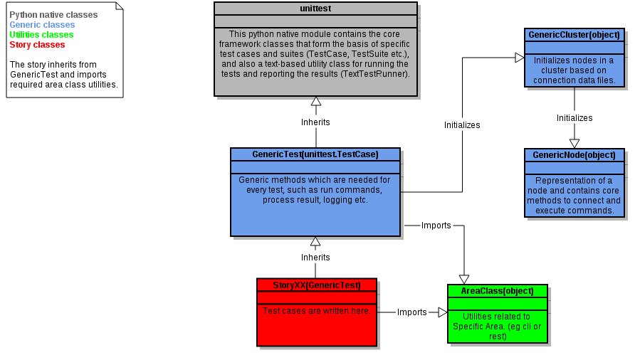

Inheritance Structure and Related Rules
==========================================

The inheritance structure of the framework is illustrated below. Please note that this is a slightly simplified view as there are a number of other area classes (in green).

To explain in brief, the difference between the different groups of classes and what their inheritance rules are:

1) Story Classes (in red)

This is where your actual test code is written. The following inheritance rules must be followed:

- Must always inherit only GenericTest

- Can import any required area classes

- Must never import any of the Generic Classes

2) Area Classes (in green)

These are utility classes with utility functions grouped by area. (E.g. So we have a CLI area class, a REST area class etc.) The following inheritance rules must be followed:

- Must only ever inherit Object

- Must never import anything from the Generic Classes

- Can import from any other required area classes

3) Generic Classes (in blue)

These classes handle connection and execution of all commands on LITP nodes. The following inheritance rules must be followed:

- Generic Test must only inherit Python unit test

- Generic Cluster and Generic Node must only inherit object

- All of the generic classes can import any area class that they require

